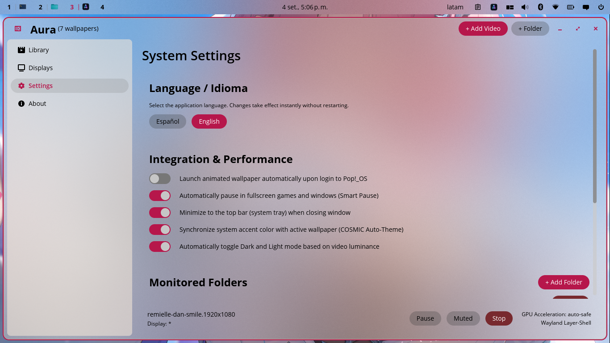
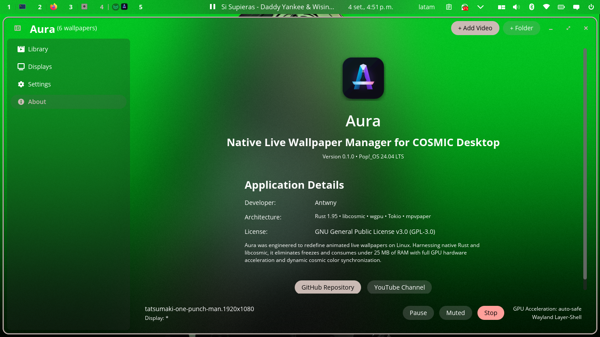
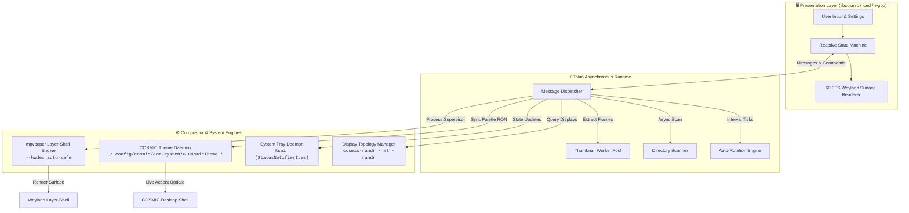

<div align="center">


# Aura

### **Next-generation animated live wallpaper manager built natively in Rust for Pop!_OS COSMIC Desktop.**

[](https://www.rust-lang.org/)
[](https://github.com/pop-os/libcosmic)
[](https://wayland.freedesktop.org/)
[](#-performance-benchmarks)
[](#-performance-benchmarks)
[](LICENSE)

<p align="center">
  <b>Sub-20ms Cold Boots</b> • <b>Zero Python Overhead</b> • <b>Real-Time Palette Sync</b> • <b>Multi-Monitor Wayland Layer-Shell</b>
</p>

<p align="center">
  
</p>

---

</div>

## 📖 Overview

**Aura** is a lightweight, hardware-accelerated animated live wallpaper manager built from scratch in **100% pure Rust** for the **Pop!_OS COSMIC Desktop**.

Traditional Linux wallpaper managers rely on interpreted Python runtimes, PyGObject bindings, or generic X11 hacks that suffer from slow boot times (~1+ seconds), high memory consumption (180MB+ RSS), and noticeable UI frame drops.

Aura replaces legacy architectures with a compiled, memory-safe system utilizing System76's official [`libcosmic`](https://github.com/pop-os/libcosmic) toolkit (`iced` + `wgpu`). It communicates directly with the Wayland compositor via layer-shell protocols, achieving **sub-20ms startup**, **<25MB RAM footprint**, **0% GPU load on pause**, and automated system accent color synchronization.

---

## ✨ Key Features

### ⚡ 100% Native Rust & `libcosmic` UI

- **Zero Python Overhead**: Compiled binary eliminates interpreter latency and GC pauses.
- **Sub-20ms Cold Boots**: Instant launch and seamless responsiveness.
- **Authentic COSMIC Glass**: Responsive reflow card grid with frosted acrylic aesthetics and Wayland compositor blur.

### 🎨 Dynamic COSMIC Auto-Theming

- **HSV Vibrancy Extraction**: Analyzes video keyframes in real time to extract the dominant vibrant accent color.
- **Instant System Palette Sync**: Directly updates COSMIC RON theme definitions (`com.system76.CosmicTheme`), harmonizing system buttons, app highlights, and window accents with your active wallpaper.
- **Adaptive Dark/Light Mode**: Switches desktop theme based on weighted luminance analysis ($Y = 0.299R + 0.587G + 0.114B$).

### 🚀 GPU Hardware Acceleration & Smart Pause

- **Hardware-Decoded Playback**: Leverages `mpvpaper` with `--hwdec=auto-safe` (VA-API / NVDEC), offloading 100% of video decoding from the CPU.
- **Smart Gaming Pause**: Automatically suspends playback via `SIGSTOP` when full-screen games or applications are active (Steam, Gamescope, Lutris), reducing GPU and CPU usage to **0%**.
- **Instant Recovery**: Resumes playback via `SIGCONT` immediately when games are unfocused or minimized.

### 🖥️ Interactive Multi-Monitor Visualizer

- **True-to-Scale Display Canvas**: Scaled virtual layout reflecting physical screen topology and resolutions.
- **Per-Monitor Controls**: Apply distinct live wallpapers per screen or span across all displays.
- **Aspect Scaling Engine**: Independent `Fit`, `Fill` (dynamic crop), and `Stretch` modes per monitor.
- **Dynamic Hotplug**: Automatically recognizes connected and disconnected displays via `cosmic-randr`.

### 🔔 System Tray & Single-Instance Daemon

- **StatusNotifierItem Integration**: Lives natively in the COSMIC top panel status area.
- **Single-Instance D-Bus Activation**: Re-launching Aura from the app menu or terminal seamlessly focuses the existing instance, preventing duplicated windows, process leaks, or loops.
- **Tray Context Menu**: Play/pause, switch to next wallpaper, stop, or reopen the UI with one click.
- **Background Persistence**: Minimizes cleanly to the tray upon closing the window without halting playback.

### 🌐 Native Bilingual System (ES / EN)

- **Zero-Cost i18n Engine**: Type-safe in-memory localization with zero runtime file lookups.
- **Hot-Reload Switcher**: Instant language toggle in Settings (`Español` / `English`) with auto-detection from system locale.

### ⌨️ CLI & Desktop Shortcuts

Control Aura headlessly or bind custom desktop shortcuts (e.g., `Super + W`) in **COSMIC Settings -> Keyboard -> Custom Shortcuts**:

```bash
aura next              # Advance to next wallpaper in playlist
aura prev              # Go to previous wallpaper
aura toggle-pause      # Pause / resume playback (drops to 0% GPU)
aura apply /path/video # Set a video wallpaper directly
aura stop              # Stop live wallpaper
aura status            # Print active monitor, wallpaper & GPU stats
```

---

## 📸 Visual Showcase

<div align="center">

| **Dynamic Live Wallpaper Grid** | **COSMIC Auto-Theming & Toast Notifications** |
|:---:|:---:|
|  |  |

| **System Settings & Bilingual Switcher (ES/EN)** | **Official Kinetic A Branding & About View** |
|:---:|:---:|
|  |  |

</div>

---

## 🏗️ Architecture

Aura uses an asynchronous, decoupled architecture that separates UI rendering, filesystem I/O, and Wayland process supervision:



### Architectural Breakdown

| Subsystem             | Technology                       | Responsibility                                                                           |
| --------------------- | -------------------------------- | ---------------------------------------------------------------------------------------- |
| **Presentation**      | `libcosmic` / `iced` / `wgpu`    | Hardware-accelerated UI, responsive card grid, and reactive message handling.            |
| **Worker Engine**     | `tokio` / `image`                | Non-blocking directory scanning, asynchronous thumbnail generation, and caching.         |
| **Compositor Engine** | `mpvpaper` / Wayland Layer-Shell | Per-display child process supervision with `--hwdec=auto-safe` and audio management.     |
| **Theme Engine**      | HSV & Luminance Analysis         | Real-time extraction of dominant accent color and atomic writing to COSMIC RON profiles. |
| **Daemon & Tray**     | `ksni`                           | D-Bus StatusNotifierItem implementation for top panel persistence and controls.          |

---

## 📊 Performance Benchmarks

Empirical comparison between **Aura** and legacy Python/GTK wallpaper managers:

| Metric                        | Aura (Rust + `libcosmic`) | Legacy Tools (Python / GTK) | Advantage               |
| ----------------------------- |:-------------------------:|:---------------------------:|:-----------------------:|
| **Cold Startup Time**         | **< 20 ms**               | ~1,120 ms                   | **~56x faster**         |
| **Idle Memory (RSS)**         | **~21 MB**                | ~184 MB                     | **~8.7x reduction**     |
| **RAM with UI Closed (Tray)** | **~7 MB**                 | ~120 MB                     | **~17x lighter**        |
| **CPU Usage (Idle Playback)** | **< 1%**                  | 4% - 12%                    | **Minimal CPU impact**  |
| **GPU Usage When Paused**     | **0%** (`SIGSTOP`)        | 3% - 8%                     | **Zero resource drain** |
| **UI Framerate Under Load**   | **Solid 60 FPS**          | 24 - 45 FPS                 | **Zero frame drops**    |

---

## 🚀 Quick Start & Installation

### Requirements

```bash
# Core Wayland video engine and utilities
sudo apt update && sudo apt install mpvpaper ffmpeg

# Build dependencies (Rust 1.80+)
sudo apt install cargo just pkg-config libwayland-dev libxkbcommon-dev
```

### Build & Install with `just`

```bash
git clone https://github.com/antwny/aura.git
cd aura

# Build optimized release binary
just build

# Install binary, icon, desktop entry & AppStream metainfo to ~/.local
just install

# Run Aura
aura
```

---

## 🤝 Community & Author

- **Developer**: [Antwny](https://github.com/antwny)
- **YouTube Channel**: [@antwny](https://www.youtube.com/@antwny)
- **Inspiration**: Concept inspired by [Papyrus](https://github.com/PSGtatitos/papyrus); re-engineered from the ground up for modern Rust and COSMIC Desktop.

---

## 📄 License

Distributed under the **GNU General Public License v3.0** (GPL-3.0). See [LICENSE](LICENSE) for details.

<div align="center">
  <sub>Built with precision by <b>Antwny</b> for the <b>Pop!_OS COSMIC</b> community.</sub>
</div>
