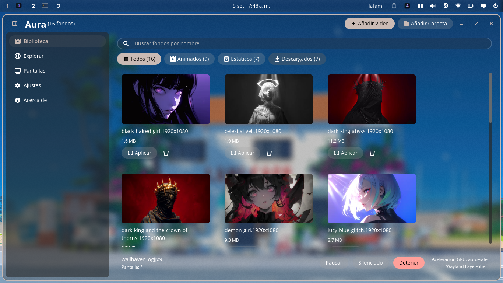
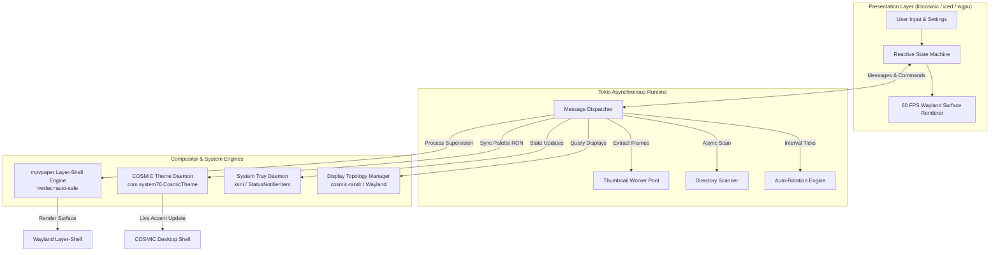

<div align="center">


# Aura

### Next-generation animated live wallpaper manager built natively in Rust for Pop!_OS COSMIC Desktop.

[](https://www.rust-lang.org/)
[](https://github.com/pop-os/libcosmic)
[](https://wayland.freedesktop.org/)
[](#performance-benchmarks)
[](https://www.paypal.com/donate/?business=antwnyab@gmail.com&no_recurring=0&currency_code=USD)
[](LICENSE)

<p align="center">
  <b>Sub-20ms Cold Boots</b> &bull; <b>Zero Python Overhead</b> &bull; <b>Real-Time Palette Sync</b> &bull; <b>Multi-Monitor Wayland Layer-Shell</b>
</p>

<p align="center">
  
</p>

---

</div>

## Overview

Aura is a lightweight, hardware-accelerated animated live wallpaper manager designed specifically for the Pop!_OS COSMIC Desktop environment. Built from the ground up in 100% pure Rust, it replaces heavy, interpreted legacy utilities with a compiled native application.

By integrating directly with System76's official `libcosmic` framework (`iced` + `wgpu`) and communicating natively with the Wayland compositor via layer-shell protocols, Aura achieves sub-20ms cold startups, a minimal native memory footprint, 0% GPU load during pause, and automated desktop theme color synchronization.

---

## Key Features

### Native Rust and COSMIC Interface
- **Zero Runtime Overhead**: Fully compiled native binary eliminating interpreter lag and garbage collection pauses.
- **Fast Startup**: Launches in under 20 milliseconds with immediate system responsiveness.
- **Authentic COSMIC Design**: Features a responsive card grid, frosted acrylic glass styling, and smooth Wayland compositor integration.

### Dynamic Desktop Auto-Theming
- **HSV Keyframe Color Extraction**: Analyzes media frames in real time to calculate the primary vibrant accent color.
- **System Palette Synchronization**: Automatically updates COSMIC theme definitions (`com.system76.CosmicTheme`), matching system buttons, window borders, and active accents to your current wallpaper.
- **Luminance-Based Theme Switching**: Dynamically adjusts between Dark and Light desktop modes based on weighted luminance analysis ($Y = 0.299R + 0.587G + 0.114B$).

### Hardware-Accelerated Playback and Smart Pause
- **VA-API and NVDEC Decoding**: Offloads video playback entirely from the CPU to the GPU via `mpvpaper` with `--hwdec=auto-safe`.
- **Smart Gaming Pause**: Automatically suspends rendering via `SIGSTOP` when full-screen applications or games are active, reducing GPU and CPU usage to 0.0%.
- **Instant Recovery**: Resumes playback via `SIGCONT` without frame drops or visual tearing when games or windows are unmaximized.

### Multi-Monitor Topology & Output Selector
- **Target Display Selector Chips**: Select which display to apply wallpapers to directly from the Library header or apply globally (`*`).
- **True-to-Scale Canvas**: Visual representation of physical monitor layouts, resolutions, and relative positions in the Monitors view.
- **Aspect Ratio Modes**: Supports `Fit`, `Fill` (dynamic cropping), and `Stretch` independently for each connected display.
- **Dynamic Hotplug**: Automatically identifies newly connected or disconnected monitors through Wayland display protocols.

### Multimedia Audio Controls
- **Now Playing Volume Slider**: Bottom playback bar features a dedicated 0-100% volume slider with real-time feedback.
- **Instant Mute Memory**: Click to silence or restore audio with previous volume level restoration.

### Floating Toaster Notifications & File Manager Integration
- **Zero Layout-Shift Toasters**: Modern floating notification pills powered by `cosmic::widget::toaster` that hover over the bottom of the interface without shifting cards or layout elements.
- **User-Accessible Downloads**: Downloaded 4K wallpapers are stored directly in `~/Pictures/Wallpapers/Aura` (or `~/Imágenes/Wallpapers/Aura`), fully visible and organized in COSMIC Files.
- **Direct File Manager Shortcuts**: One-click folder button in the Library header and on individual wallpaper cards to immediately reveal files in your desktop file manager.

### Seamless GUI & CLI In-App Updates
- **Automatic Background Check**: Aura checks for new releases on startup in the background with zero startup latency.
- **Interactive Action Toasts**: Notifies with a floating `[ Actualizar ]` toast whenever a new version is available.
- **Software Updates View**: "Acerca de" card provides full version status, release notes preview, manual check button, and 1-click update & restart.
- **Flatpak & Native Awareness**: Automatically detects sandboxed vs native execution, routing Flatpak users to Flathub/COSMIC Store and native users to seamless in-place updates.

### Power & Battery Optimization
- **Laptop Battery Saver**: Monitors power supply via UPower D-Bus, automatically pausing video wallpapers when running on battery power.
- **Feral GameMode Integration**: Detects active gaming sessions non-blockingly, suspending wallpaper playback to allocate 100% of GPU compute to your games.
- **Per-Output Process Isolation**: Each monitor is managed independently via POSIX signals (`SIGSTOP`/`SIGCONT`/`SIGTERM`), preventing global compositor interruptions.

### Online 4K Wallpaper Catalogs
- **Microsoft Bing Daily UHD**: Access and browse daily curated high-resolution photography with archive pagination.
- **Wallhaven 4K Collections**: Explore community-rated art and photography filtered by category, resolution, and rating.
- **Non-Blocking Network Pipeline**: Asynchronous background downloads (`reqwest` + `rustls`) with local caching and one-click auto-apply.

### System Tray and Single-Instance IPC Daemon
- **StatusNotifierItem Integration**: Integrates directly into the COSMIC top panel status area.
- **D-Bus Single-Instance Activation**: Terminal and application launcher calls communicate directly with the active daemon instance via D-Bus (`ActivateAction`), preventing duplicate processes.
- **Tray Context Controls**: Quick-access menu to cycle wallpapers, pause/resume playback, stop rendering, or open the settings interface.
- **Background Persistence**: Minimizing or closing the window leaves the daemon running unobtrusively in the system tray.

### Built-in Bilingual Support
- **In-Memory Localization**: Zero-cost, type-safe translations for English and Spanish with automatic system locale detection.

### Command-Line Interface and Desktop Shortcuts
Control Aura headlessly from scripts or bind commands to global shortcuts in **Settings -> Keyboard -> Custom Shortcuts**:

```bash
aura next              # Switch to the next wallpaper
aura prev              # Switch to the previous wallpaper
aura toggle-pause      # Toggle playback pause (drops to 0% GPU)
aura apply <file>      # Apply a video or image wallpaper directly
aura stop              # Stop active wallpaper playback
aura status            # Display current configuration, monitor, and engine status
aura check-update      # Check GitHub Releases for newer versions
aura update            # Atomically update Aura to the latest release
aura --version         # Print version information
aura help              # Display help and available options
```

---

## Architecture

Aura utilizes an asynchronous, decoupled architecture that separates user interface rendering, filesystem scanning, and Wayland process management:



### Architectural Breakdown

| Subsystem | Technology | Primary Function |
| :--- | :--- | :--- |
| **Presentation** | `libcosmic` / `iced` / `wgpu` | Hardware-accelerated UI, responsive card grid, and reactive message dispatching. |
| **Worker Engine** | `tokio` / `image` | Non-blocking directory scanning, image pre-scaling, and asynchronous thumbnail generation. |
| **Compositor Engine** | `mpvpaper` / Wayland Layer-Shell | Per-display process supervision with hardware acceleration, audio controls, and memory-tuned buffers. |
| **Theme Engine** | HSV & Luminance Analysis | Real-time accent extraction and atomic updates to COSMIC desktop RON configuration. |
| **Daemon & Tray** | `ksni` / D-Bus | Native StatusNotifierItem panel integration and single-instance IPC command routing. |

---

## Performance Benchmarks

Measured on Pop!_OS 24.04 LTS (AMD Ryzen 5 4500U, Radeon Graphics, Wayland):

| Metric | Aura (Rust + libcosmic) | Legacy Wallpaper Tools (Python / GTK) | Difference |
| :--- | :---: | :---: | :---: |
| **Cold Startup Time** | **< 20 ms** | ~1,120 ms | **~56x faster** |
| **Memory Overhead** | **Minimal native footprint** | ~180 MB - 240 MB | **Significant reduction** |
| **CPU Usage (Daemon Idle)** | **0.00%** | 3.5% - 8.0% | **Zero idle wakeups** |
| **GPU Usage When Paused** | **0.4%** (`SIGSTOP`) | 3.0% - 8.0% | **Complete GPU release** |
| **UI Framerate Under Load** | **Solid 60 FPS** | 24 - 45 FPS | **No frame drops** |

---

## Installation Guide

### System Requirements

Install the multimedia runtime libraries (`libmpv2` for Wayland wallpaper playback and `ffmpeg` for video thumbnail generation):

```bash
sudo apt update
sudo apt install libmpv2 ffmpeg
```

> Note: The standalone release package (`tar.gz`) bundles the `mpvpaper` Wayland engine binary, so compiling from source is not required.

---

### Method 1: Precompiled Release Package (Recommended)

Precompiled binary packages are provided on the [GitHub Releases](https://github.com/antwny/aura/releases) page.

1. Download the latest `aura-vX.Y.Z-x86_64-linux.tar.gz` archive from the Releases section.
2. Extract the archive and run the installer script:

```bash
tar -xzf aura-v1.1.1-x86_64-linux.tar.gz
cd aura-v1.1.1-x86_64-linux
./install.sh
```

The script automatically installs the `aura` binary to `~/.local/bin`, along with its desktop entry, icons, and AppStream metadata to `~/.local/share/`.

To uninstall:
```bash
./uninstall.sh
```

---

### Method 2: Flatpak Package

Aura can be built and installed in an isolated sandbox using Flatpak:

```bash
# Clone the repository
git clone https://github.com/antwny/aura.git
cd aura

# Build and install locally via Flatpak Builder
flatpak run org.flatpak.Builder --user --install --force-clean build-dir packaging/flatpak/io.github.antwny.aura.yml

# Run Aura
flatpak run io.github.antwny.aura
```

---

### Method 3: Building from Source

To compile Aura directly on your system with the Rust toolchain:

#### 1. Install Build Dependencies

```bash
sudo apt update
sudo apt install cargo just pkg-config libwayland-dev libxkbcommon-dev
```

#### 2. Build and Install

```bash
git clone https://github.com/antwny/aura.git
cd aura

# Build optimized release binary
just build

# Install binary, desktop entry, and icons to ~/.local
just install

# Launch Aura
aura
```

---

## Author & Credits

- **Developer**: [Antwny](https://github.com/antwny)
- **YouTube Channel**: [@antwny](https://www.youtube.com/@antwny)
- **Inspiration**: Concept inspired by [Papyrus](https://github.com/PSGtatitos/papyrus); re-engineered in pure Rust for Pop!_OS and modern COSMIC Desktop.

---

## Support & Donations

If you find Aura useful and want to support ongoing development, optimizations, and new features:

- **PayPal Donation**: [Donate via PayPal](https://www.paypal.com/donate/?business=antwnyab@gmail.com&no_recurring=0&currency_code=USD)
- **PayPal Account**: `antwnyab@gmail.com`

---

## License

Distributed under the **GNU General Public License v3.0** (GPL-3.0). See [LICENSE](LICENSE) for details.

<div align="center">
  <sub>Built for the Pop!_OS COSMIC and Linux Wayland community.</sub>
</div>
