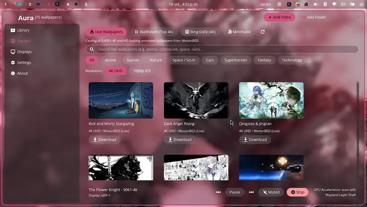
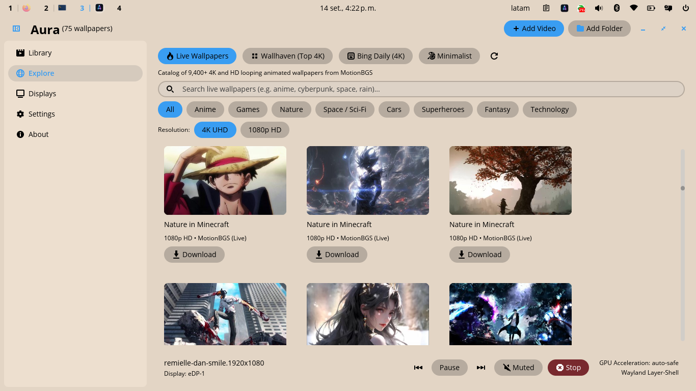
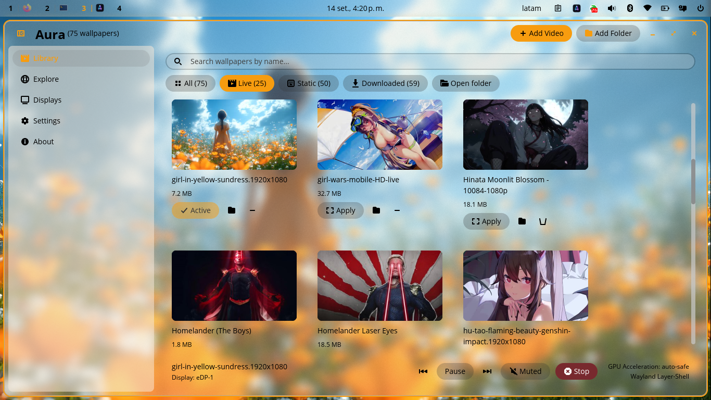
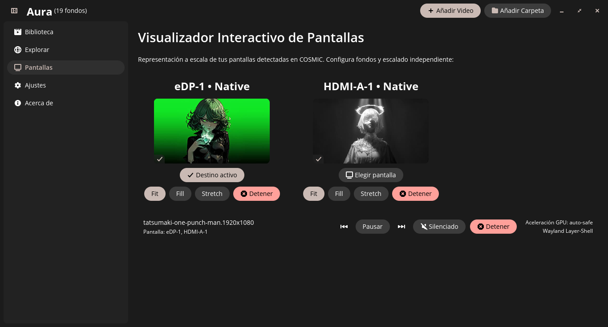
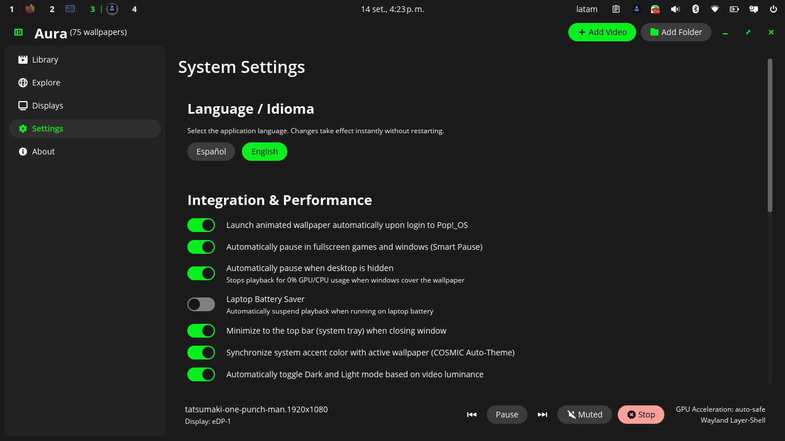

<div align="center">


# Aura

### Alive wallpapers for Linux. Built for the modern desktop.

**Transform your Linux and COSMIC workspace with fluid animated backgrounds, dynamic desktop color matching, and zero lag when gaming.**

[](https://github.com/antwny/aura/releases)
[](https://github.com/pop-os/libcosmic)
[](https://wayland.freedesktop.org/)
[](#-smart-auto-pause-0-gpu--cpu-in-games)
[](LICENSE)
[](https://www.paypal.com/donate/?business=antwnyab@gmail.com&no_recurring=0&currency_code=USD)

<br/>

### ⚡ Quick Install (Ready in 30 seconds)

Run this single command in your terminal to install or update Aura with its video engine bundled:

```bash
curl -fsSL https://raw.githubusercontent.com/antwny/aura/main/install.sh | bash
```

*Native Rust performance for CachyOS, Arch Linux, Pop!_OS, Fedora, openSUSE, and any distribution running COSMIC Desktop.*

> **💡 Prerequisites for live video playback & video thumbnails:**
> - **CachyOS / Arch Linux**: `sudo pacman -S --needed mpv ffmpeg`
> - **Pop!_OS / Ubuntu / Debian**: `sudo apt install -y libmpv2 ffmpeg`
> - **Fedora**: `sudo dnf install -y mpv-libs ffmpeg-free`
> - **openSUSE**: `sudo zypper install -y mpv ffmpeg`

<br/>

<!-- GitHub does not render HTML <video> elements in README files. -->
<p align="center">
  <a href="https://antwny.github.io/aura/assets/video/aura-showcase.mp4">
    
  </a>
</p>

<p align="center"><sub><i>Live recording: COSMIC Desktop • Wayland Layer-Shell • Seamless MPV IPC Engine — click the image to play</i></sub></p>

<br/>
<br/>

</div>

---

## ✨ Why You'll Love Aura

In the past, running animated wallpapers on Linux meant dealing with clunky background scripts that drained your laptop battery and made games stutter.

**Aura changes everything.** Engineered in native compiled Rust for Wayland and COSMIC, it delivers smooth 60 FPS animations when viewing your desktop, and automatically freezes to **0% CPU / 0% GPU** the instant you play a game or open a window.

---

### 🔥 Thousands of Free Live & 4K Wallpapers Built-In

No need to scour the web for compatible video clips. Browse and download thousands of stunning wallpapers directly within the app:

<p align="center">
  
</p>

- **MotionBGS Live Wallpapers**: High-quality curated video loops in both **4K** and **1080p** with real-time download progress tracking and instant preview.
- **Wallhaven UHD**: Endless collection of crisp 4K & 8K static artwork, landscapes, and anime backgrounds.
- **Bing Daily Wallpaper**: Automatically fetch Microsoft Bing's daily high-resolution landscape photo.
- **DenverCoder1 Minimalist Flat Art**: Elegant vector landscapes and illustrations that look clean on any setup.
- **Category Filters & Instant Search**: Filter by Anime, Nature, Sci-Fi, Cyberpunk, Gaming, Minimalist, or search by keywords in real time.

---

### 🎨 Magic Desktop Auto-Theming

Bring your entire desktop into harmony. Aura automatically analyzes the colors in your active video or static wallpaper and adapts your entire COSMIC Desktop theme in real time:

<p align="center">
  
</p>

- **Harmonized Accents**: Window borders, buttons, highlights, and system toggles dynamically shift to match your background's palette.
- **Intelligent Contrast**: Automatically computes WCAG-compliant text contrast for readability.
- **Auto Light / Dark Adaptation**: Shifts theme tone according to the ambiance of the wallpaper.
- **Instant Unixporn Ricing**: Get a cohesive desktop aesthetic without spending hours editing configuration files.

---

### 🖥️ Multi-Screen Studio

Have dual monitors or an ultrawide setup? Aura gives you complete independent control over every display:

<p align="center">
  
</p>

- **Independent Wallpapers**: Assign different live videos or static images to each monitor.
- **Per-Screen Scaling**: Choose between **Fit** (letterbox), **Fill** (zoom crop), or **Stretch** individually.
- **Live Canvas Visualizer**: See a proportional representation of your physical monitor arrangement.
- **Hotplug Detection**: Seamlessly detects connected or disconnected monitors on the fly.

<div align="center">
  <video src="https://antwny.github.io/aura/assets/video/multimonitor-showcase.mp4" poster="https://antwny.github.io/aura/assets/video/multimonitor-poster.webp" controls loop muted playsinline width="80%"></video>
  <p><sub><i>Independent video playback per monitor with zero tearing</i></sub></p>
</div>

---

### 🎮 Smart Auto-Pause: 0% GPU & CPU in Games

The biggest concern with live wallpapers is performance. Aura solves this completely:

<p align="center">
  
</p>

- **Window Occlusion Detection (`-p`)**: When any application window covers your desktop, Aura automatically halts rendering to save power.
- **Fullscreen Game Detection**: Launches Steam games or full-screen apps with **zero frame drops**. 100% of your GPU and CPU remain dedicated to your game.
- **Battery Saver Mode**: Automatically switches to ultra-low-power mode or pauses animation when your laptop is unplugged.
- **Real-Time Volume & Audio Mute**: Enjoy live wallpapers with atmospheric soundtracks, adjust volume with a slider, or mute them anytime with a single click.

---

## ⌨️ Effortless Control & Keyboard Shortcuts

Control Aura seamlessly with global keyboard shortcuts. Open **COSMIC Settings → Keyboard → Custom Shortcuts** and assign your favorite key combinations:

| Action | Command | Recommended Shortcut |
| :--- | :--- | :--- |
| **Next Wallpaper** | `aura next` | <kbd>Super</kbd> + <kbd>W</kbd> |
| **Previous Wallpaper** | `aura prev` | <kbd>Super</kbd> + <kbd>Shift</kbd> + <kbd>W</kbd> |
| **Pause / Resume** (0% GPU) | `aura toggle-pause` | <kbd>Super</kbd> + <kbd>P</kbd> |
| **Apply Video Directly** | `aura apply /path/to/video.mp4` | Right-click in file manager |
| **Stop Wallpaper** | `aura stop` | Custom script / shortcut |
| **System Status** | `aura status` | Terminal check |
| **Update Aura** | `aura update` | Automatic in-app update |

---

## 🚀 Installation Options

### Method 1: One-Line Web Installer (Fastest & Recommended)

Install Aura and its bundled video engine in a single step:

```bash
curl -fsSL https://raw.githubusercontent.com/antwny/aura/main/install.sh | bash
```

> **Tip**: To install system-wide (`/usr/local` with sudo), pass `--system`:
> ```bash
> curl -fsSL https://raw.githubusercontent.com/antwny/aura/main/install.sh | bash -s -- --system
> ```

---

### Method 2: Precompiled Release Package

1. Download `aura-v1.3.3-x86_64-linux.tar.gz` from [GitHub Releases](https://github.com/antwny/aura/releases).
2. Extract the archive and run the installer:

```bash
tar -xzf aura-v1.3.3-x86_64-linux.tar.gz
cd aura-v1.3.3-x86_64-linux
./install.sh
```

To uninstall at any time:
```bash
./uninstall.sh
```

---

### Method 3: Flatpak Package

Build and run in an isolated sandbox using Flatpak:

```bash
git clone https://github.com/antwny/aura.git
cd aura
flatpak run org.flatpak.Builder --user --install --force-clean build-dir packaging/flatpak/io.github.antwny.aura.yml
flatpak run io.github.antwny.aura
```

---

### Method 4: Build from Source (Rust Developers)

Requirements: `cargo`, `just`, `pkg-config`, `libwayland-dev`, `libxkbcommon-dev`.

```bash
git clone https://github.com/antwny/aura.git
cd aura
just build
just install
aura
```

---

## 📊 Performance Benchmarks

Tested on Linux with COSMIC Desktop (AMD Ryzen 5 4500U, Radeon Graphics, Wayland Layer-Shell):

| Benchmark | Aura (Compiled Rust) | Legacy Python/GTK Tools | Advantage |
| :--- | :---: | :---: | :---: |
| **Cold Startup Time** | **< 20 ms** | ~1,120 ms | **56x faster** |
| **RAM Footprint** | **Minimal native footprint** | ~220 MB | **Lightweight** |
| **Idle CPU (Paused/Occluded)** | **0.00%** | 3.5% - 8.0% | **Zero battery drain** |
| **GPU Usage When Paused** | **0.0%** (Hardware halted) | 4.0% - 10.0% | **100% GPU for games** |
| **Desktop UI Framerate** | **Smooth 60+ FPS** | 24 - 45 FPS | **Silky smooth** |

---

## 💬 Community & Support

- **Creator & Maintainer**: [Antwny](https://github.com/antwny)
- **YouTube Tutorials & Demos**: [@antwny](https://www.youtube.com/@antwny)
- **Reddit Community**: [@antw-ny](https://www.reddit.com/user/antw-ny/)

### Support the Project ⭐
If Aura makes your desktop look awesome, please consider:
- Giving the repository a **Star** on [GitHub](https://github.com/antwny/aura) ⭐!
- [Donating via PayPal](https://www.paypal.com/donate/?business=antwnyab@gmail.com&no_recurring=0&currency_code=USD) to support ongoing development, optimizations, and new features.

---

## 📜 License

Aura is proudly **Free & Open Source** software licensed under the **GNU General Public License v3.0** (GPL-3.0). See [LICENSE](LICENSE) for details.

<div align="center">
  <sub>Crafted with passion for the COSMIC Desktop, Linux, and Wayland community.</sub>
</div>
