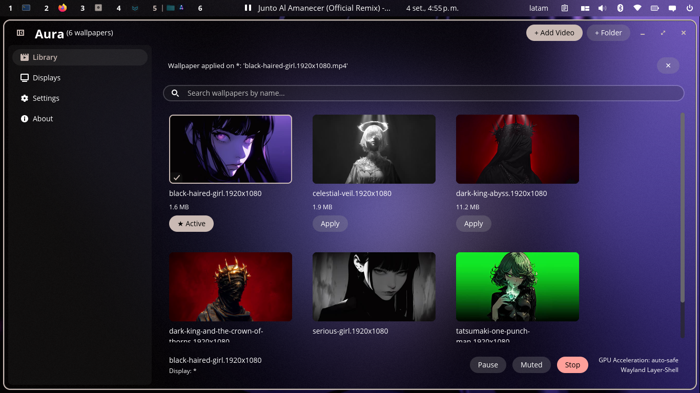
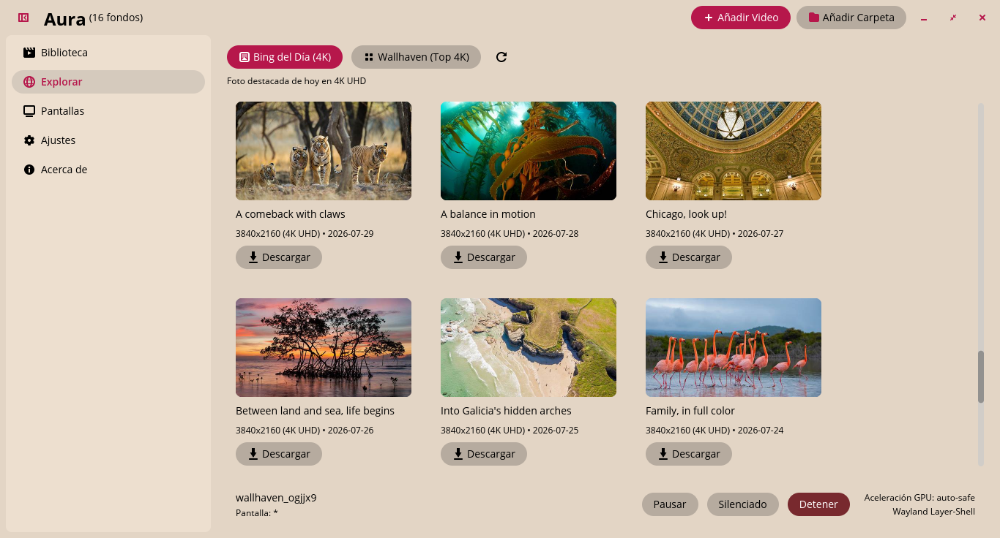
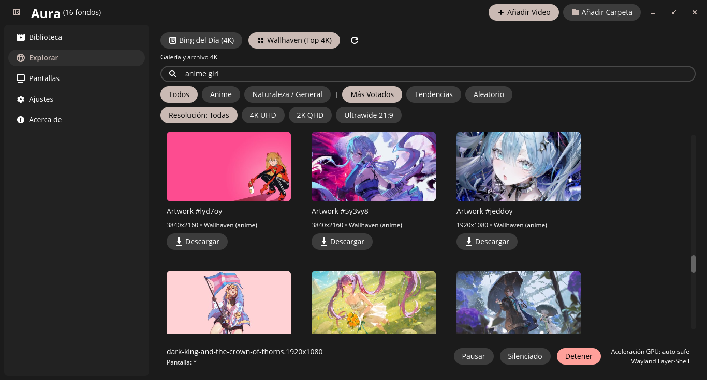

<div align="center">


# Aura

### Next-generation animated live wallpaper manager built natively in Rust for Pop!_OS COSMIC Desktop.

[](https://github.com/antwny/aura/releases)
[](https://www.rust-lang.org/)
[](https://github.com/pop-os/libcosmic)
[](https://wayland.freedesktop.org/)
[](#performance-benchmarks)
[](https://www.paypal.com/donate/?business=antwnyab@gmail.com&no_recurring=0&currency_code=USD)
[](LICENSE)

<p align="center">
  <b>Sub-20ms Cold Boots</b> • <b>Zero Python Overhead</b> • <b>Real-Time Palette Sync</b> • <b>Multi-Monitor Wayland Layer-Shell</b>
</p>

<p align="center">
  
</p>

<p align="center">
  
</p>

<p align="center">
  
</p>

---

</div>

## Overview

Aura is a lightweight, hardware-accelerated animated live wallpaper manager designed specifically for the Pop!_OS COSMIC Desktop environment. Built from the ground up in 100% pure Rust, it replaces heavy, interpreted legacy utilities with a compiled native application.

By integrating directly with System76's official `libcosmic` framework (`iced` + `wgpu`) and communicating natively with the Wayland compositor via layer-shell protocols, Aura achieves sub-20ms cold startups, a minimal native memory footprint, 0% GPU load during pause, and automated desktop theme color synchronization.

---

## Key Features

- **Native Rust & COSMIC UI**: Built with `libcosmic` (`iced` + `wgpu`), sub-20ms cold startups, zero runtime overhead, frosted acrylic styling, and seamless Wayland layer-shell integration.
- **Dynamic Desktop Auto-Theming**: Real-time HSV keyframe color extraction and COSMIC v2 theme synchronization dynamically adapting desktop accent colors, button highlights (WCAG contrast), and dark/light modes.
- **Hardware Acceleration & Smart Pause**: VA-API / NVDEC GPU decoding via `mpvpaper` on Wayland layer `bottom`; automatic `SIGSTOP` pause during full-screen apps, games, and battery operation (0% GPU/CPU).
- **Multi-Monitor Topology & Scaling**: Per-display wallpaper targeting, true-to-scale visual canvas, hotplug detection, and independent `Fit`, `Fill` (zoom crop), and `Stretch` modes with solid black ultrawide letterboxing.
- **Playlist Auto-Rotation**: Hands-free background rotation with customizable timer intervals and playback order (random or sequential).
- **Online Wallpaper Catalogs**: Wallhaven 4K, Bing Daily UHD, and DenverCoder1 Minimalistic Flat Art collections with category filters, keyword search, tag exploration, and non-blocking background downloads.
- **Multimedia Audio Controls**: Bottom playback bar with dedicated 0-100% volume slider and instant mute toggle with level memory.
- **Desktop & File Manager Integration**: Non-shifting floating toast notifications (`cosmic::widget::toaster`), user-accessible wallpaper storage (`~/Pictures/Wallpapers/Aura`), and 1-click reveal in COSMIC Files.
- **Integrated In-App GUI & CLI Updates**: Background release checks with interactive action toasts, 1-click atomic self-updates in the About view, and automatic Flatpak vs. native package routing.
- **Tray Menu & Headless CLI**: StatusNotifierItem tray menu for playback controls, D-Bus single-instance activation, and full CLI control for global shortcuts.
- **Bilingual (ES / EN)**: Zero-cost, type-safe in-memory localization with automatic system locale detection.

### Command-Line Interface and Desktop Shortcuts

Control Aura headlessly from scripts or bind commands to global shortcuts in **Settings -> Keyboard -> Custom Shortcuts**:

```bash
aura next              # Switch to the next wallpaper
aura prev              # Switch to the previous wallpaper
aura toggle-pause      # Toggle playback pause (drops to 0% GPU)
aura apply <file>      # Apply a video or image wallpaper directly
aura stop              # Stop active wallpaper playback
aura status            # Display current configuration, monitor, and engine status
aura check-update      # Check GitHub Releases for newer versions
aura update            # Atomically update Aura to the latest release
aura --daemon          # Run in background as daemon without opening GUI
aura --version         # Print version information
aura help              # Display help and available options
```

---

## Performance Benchmarks

Measured on Pop!_OS 24.04 LTS (AMD Ryzen 5 4500U, Radeon Graphics, Wayland):

| Metric                      | Aura (Rust + libcosmic)      | Legacy Wallpaper Tools (Python / GTK) | Difference                |
|:--------------------------- |:----------------------------:|:-------------------------------------:|:-------------------------:|
| **Cold Startup Time**       | **< 20 ms**                  | ~1,120 ms                             | **~56x faster**           |
| **Memory Overhead**         | **Minimal native footprint** | ~180 MB - 240 MB                      | **Significant reduction** |
| **CPU Usage (Daemon Idle)** | **0.00%**                    | 3.5% - 8.0%                           | **Zero idle wakeups**     |
| **GPU Usage When Paused**   | **0.4%** (`SIGSTOP`)         | 3.0% - 8.0%                           | **Complete GPU release**  |
| **UI Framerate Under Load** | **Solid 60 FPS**             | 24 - 45 FPS                           | **No frame drops**        |

---

## Installation Guide

### System Requirements

Install the multimedia runtime libraries (`libmpv2` for Wayland wallpaper playback and `ffmpeg` for video thumbnail generation):

```bash
sudo apt update
sudo apt install libmpv2 ffmpeg
```

> Note: The standalone release package (`tar.gz`) bundles the `mpvpaper` Wayland engine binary, so compiling from source is not required.

---

### Method 1: Precompiled Release Package (Recommended)

Precompiled binary packages are provided on the [GitHub Releases](https://github.com/antwny/aura/releases) page.

1. Download the latest `aura-vX.Y.Z-x86_64-linux.tar.gz` archive from the Releases section.
2. Extract the archive and run the installer script:

```bash
tar -xzf aura-v1.2.1-x86_64-linux.tar.gz
cd aura-v1.2.1-x86_64-linux
./install.sh
```

The script automatically installs the `aura` binary to `~/.local/bin`, along with its desktop entry, icons, and AppStream metadata to `~/.local/share/`.

To uninstall:

```bash
./uninstall.sh
```

---

### Method 2: Flatpak Package

Aura can be built and installed in an isolated sandbox using Flatpak:

```bash
# Clone the repository
git clone https://github.com/antwny/aura.git
cd aura

# Build and install locally via Flatpak Builder
flatpak run org.flatpak.Builder --user --install --force-clean build-dir packaging/flatpak/io.github.antwny.aura.yml

# Run Aura
flatpak run io.github.antwny.aura
```

---

### Method 3: Building from Source

To compile Aura directly on your system with the Rust toolchain:

#### 1. Install Build Dependencies

```bash
sudo apt update
sudo apt install cargo just pkg-config libwayland-dev libxkbcommon-dev
```

#### 2. Build and Install

```bash
git clone https://github.com/antwny/aura.git
cd aura

# Build optimized release binary
just build

# Install binary, desktop entry, and icons to ~/.local
just install

# Launch Aura
aura
```

---

## Author & Credits

- **Developer**: [Antwny](https://github.com/antwny)
- **YouTube Channel**: [@antwny](https://www.youtube.com/@antwny)
- **Inspiration**: Concept inspired by [Papyrus](https://github.com/PSGtatitos/papyrus); re-engineered in pure Rust for Pop!_OS and modern COSMIC Desktop.

---

## Support & Donations

If you find Aura useful and want to support ongoing development, optimizations, and new features:

- **PayPal Donation**: [Donate via PayPal](https://www.paypal.com/donate/?business=antwnyab@gmail.com&no_recurring=0&currency_code=USD)
- **PayPal Account**: `antwnyab@gmail.com`

---

## License

Distributed under the **GNU General Public License v3.0** (GPL-3.0). See [LICENSE](LICENSE) for details.

<div align="center">
  <sub>Built for the Pop!_OS COSMIC and Linux Wayland community.</sub>
</div>
