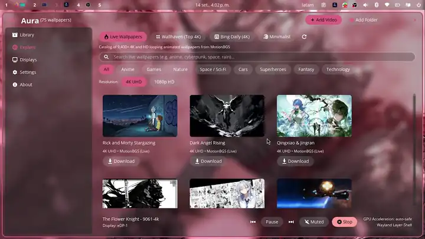
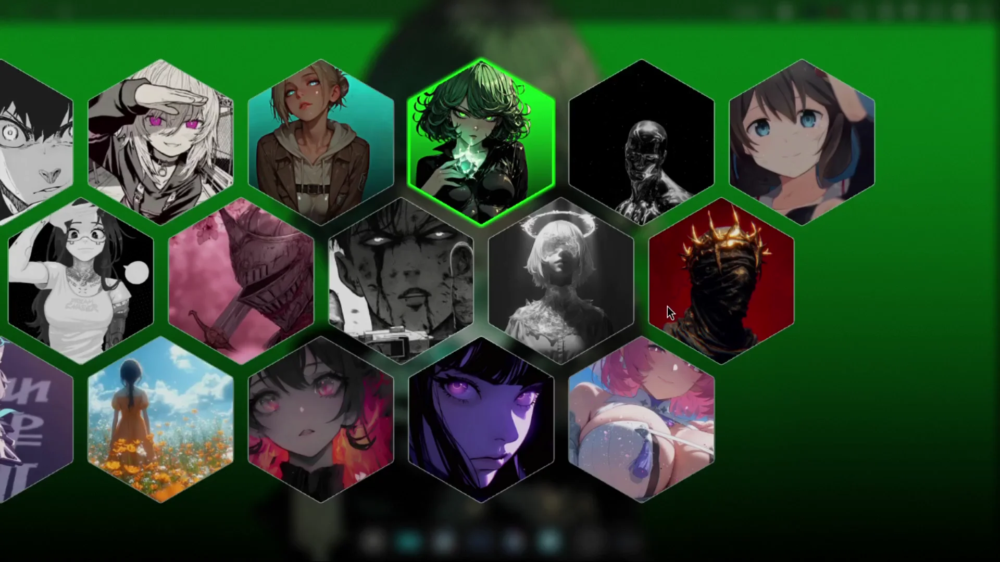
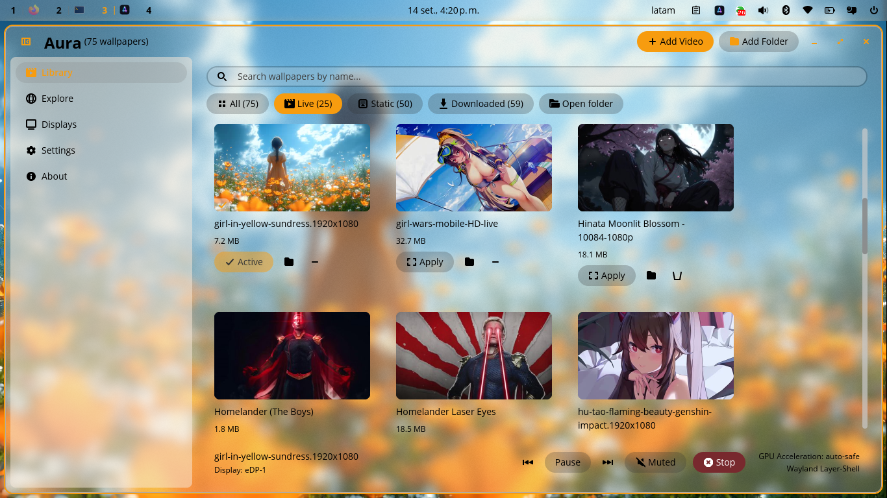
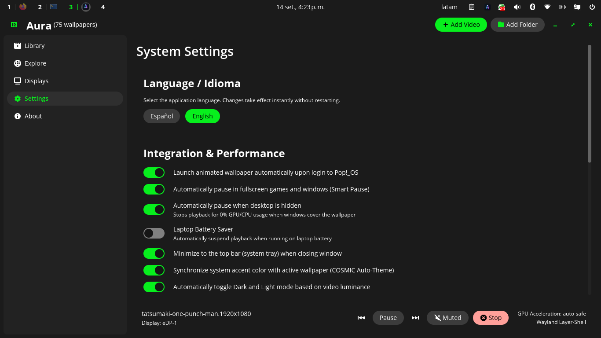

<div align="center">


# Aura

### Alive wallpapers for Linux. Built for the modern desktop.

**Transform your Linux and COSMIC workspace with fluid animated backgrounds, dynamic desktop color matching, and zero lag when gaming.**

[](https://github.com/antwny/aura/releases)
[](https://github.com/pop-os/libcosmic)
[](https://wayland.freedesktop.org/)
[](#-smart-auto-pause-0-gpu--cpu-in-games)
[](LICENSE)
[](https://www.paypal.com/donate/?business=antwnyab@gmail.com&no_recurring=0&currency_code=USD)

<br/>

### ⚡ Quick Install (One Command)

```bash
curl -fsSL https://raw.githubusercontent.com/antwny/aura/main/install.sh | bash
```

*Bundled video engine included. Compatible with CachyOS, Arch Linux, Pop!_OS, Fedora, openSUSE, and any distribution running COSMIC Desktop.*

> **Prerequisites for video playback & thumbnails:**
> - **Arch / CachyOS**: `sudo pacman -S --needed mpv ffmpeg`
> - **Pop!_OS / Ubuntu / Debian**: `sudo apt install -y libmpv2 ffmpeg`
> - **Fedora**: `sudo dnf install -y mpv-libs ffmpeg-free`
> - **openSUSE**: `sudo zypper install -y mpv ffmpeg`

<br/>

<p align="center">
  <a href="https://antwny.github.io/aura/assets/video/aura-showcase.mp4">
    
  </a>
</p>
<p align="center"><sub><i>Live recording: COSMIC Desktop • Wayland Layer-Shell • Seamless MPV IPC Engine — click to play</i></sub></p>

</div>

---

## ✨ Features at a Glance

- **Native Rust & Wayland Layer-Shell**: Smooth 60 FPS rendering with zero compositor tearing.
- **Smart Auto-Pause (0% CPU / 0% GPU)**: Instantly halts video playback when windows cover the desktop or when launching fullscreen games.
- **Online Catalogs**: Browse and download thousands of curated live and static wallpapers (MotionBGS 4K/1080p, Wallhaven UHD, Bing Daily, DenverCoder1).
- **Dynamic Desktop Auto-Theming**: Automatically extracts color palettes from your wallpaper to theme COSMIC window borders, accents, and controls.
- **Multi-Monitor Studio**: Set independent wallpapers, scaling modes (Fit, Fill, Stretch), and arrangements per screen with live hotplug support.
- **Quick Switcher HUD**: Floating heads-up display overlay summonable from anywhere with a global shortcut.

---

### ⚡ Quick Switcher HUD

Summon a floating overlay anywhere on your desktop with `aura switcher`:

<p align="center">
  <a href="https://antwny.github.io/aura/assets/video/hud-showcase.mp4">
    
  </a>
</p>

- **3 Visual Styles**:
  - **Honeycomb HUD**: Geometric pointy-topped hexagon matrix with smooth camera lerp, hover expansion, and edge panning.
  - **Cinematic HUD**: Tilted parallelogram cards with 3D perspective and ambient halo glow.
  - **Classic Dock**: Minimalist dock bar with interactive hover pop-out and slide momentum.
- **Cursor Awareness**: Spawns directly on the monitor where your mouse pointer is located.
- **Fluid Navigation**: Arrow keys, `WASD`, mouse scroll, edge hover, and 1-click wallpaper apply.
- **In-HUD Shortcuts**: <kbd>Space</kbd> to Pause/Resume, <kbd>F</kbd> for Favorites, <kbd>Esc</kbd> to dismiss.

---

### 🎨 Dynamic Auto-Theming

<p align="center">
  
</p>

- **Harmonized Accents**: Shifts desktop accent colors to match wallpaper hues.
- **WCAG Contrast**: Automatically verifies legible text contrast.
- **Auto Dark / Light**: Adapts palette luminance according to the active background.

---

### 🎮 Smart Auto-Pause: 0% GPU & CPU in Games

<p align="center">
  
</p>

- **Window Occlusion**: Pauses playback when any application window covers the desktop.
- **Fullscreen Games**: Frees 100% of GPU and CPU resources for maximum gaming FPS.
- **Battery Saver**: Automatically halts video playback when unplugged to preserve laptop battery.
- **Audio Control**: Built-in volume slider and instant mute toggle.

---

## ⌨️ Shortcuts & CLI

| Action | Command | Recommended Shortcut |
|:---|:---|:---|
| **Quick Switcher HUD** | `aura switcher` | <kbd>Super</kbd> + <kbd>Alt</kbd> + <kbd>W</kbd> |
| **Next Wallpaper** | `aura next` | <kbd>Super</kbd> + <kbd>W</kbd> |
| **Previous Wallpaper** | `aura prev` | <kbd>Super</kbd> + <kbd>Shift</kbd> + <kbd>W</kbd> |
| **Pause / Resume** (0% GPU) | `aura toggle-pause` | <kbd>Super</kbd> + <kbd>P</kbd> |
| **Apply Video Directly** | `aura apply <file>` | File manager integration |
| **Stop Wallpaper** | `aura stop` | Terminal / script |
| **System Status** | `aura status` | Terminal health check |

---

## 🚀 Installation

### One-Line Installer (Recommended)
```bash
curl -fsSL https://raw.githubusercontent.com/antwny/aura/main/install.sh | bash
```

### Precompiled Release Package
Download `aura-v1.6.1-x86_64-linux.tar.gz` from [GitHub Releases](https://github.com/antwny/aura/releases):
```bash
tar -xzf aura-v1.6.1-x86_64-linux.tar.gz
cd aura-v1.6.1-x86_64-linux
./install.sh
```

### Build from Source
```bash
git clone https://github.com/antwny/aura.git
cd aura
cargo build --release
install -m 755 target/release/aura ~/.local/bin/aura
```

---

## 📊 Performance Benchmarks

*Tested on Linux / COSMIC Desktop (AMD Ryzen 5 4500U, Radeon Graphics, Wayland Layer-Shell):*

| Benchmark | Aura (Rust) | Legacy Python/GTK Tools | Advantage |
|:---|:---:|:---:|:---:|
| **Cold Startup Time** | **< 20 ms** | ~1,120 ms | **56x faster** |
| **Idle CPU (Paused / Occluded)** | **0.00%** | 3.5% - 8.0% | **Zero battery drain** |
| **GPU Usage When Paused** | **0.0%** | 4.0% - 10.0% | **100% GPU for games** |
| **Desktop UI Framerate** | **60+ FPS** | 24 - 45 FPS | **Silky smooth** |

---

## Acknowledgments & License

Aura is Free & Open Source software licensed under the **GNU General Public License v3.0** (GPL-3.0). See [LICENSE](LICENSE) for details.

Inspirations & references: [Papyrus](https://github.com/PSGtatitos/papyrus) and [skwd-wall](https://github.com/liixini/skwd-wall).

- **Community**: [@antwny on YouTube](https://www.youtube.com/@antwny) • [@antw-ny on Reddit](https://www.reddit.com/user/antw-ny/)
- Support the project with a star on [GitHub](https://github.com/antwny/aura) ⭐ or donate via [PayPal](https://www.paypal.com/donate/?business=antwnyab@gmail.com&no_recurring=0&currency_code=USD).
